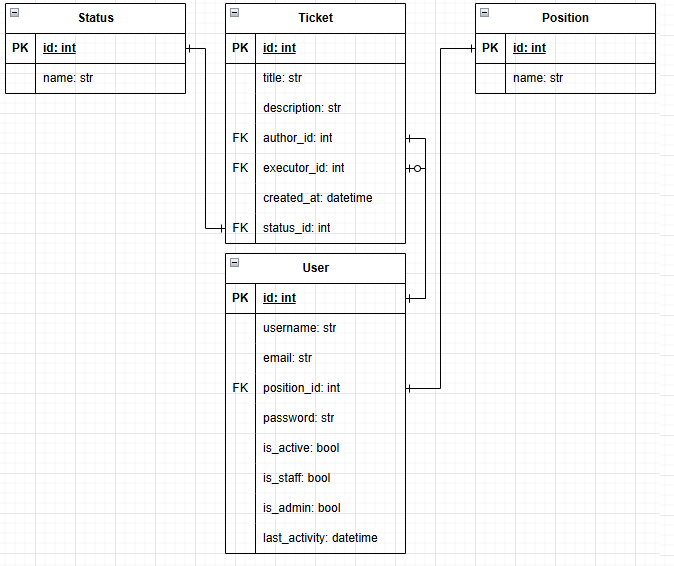
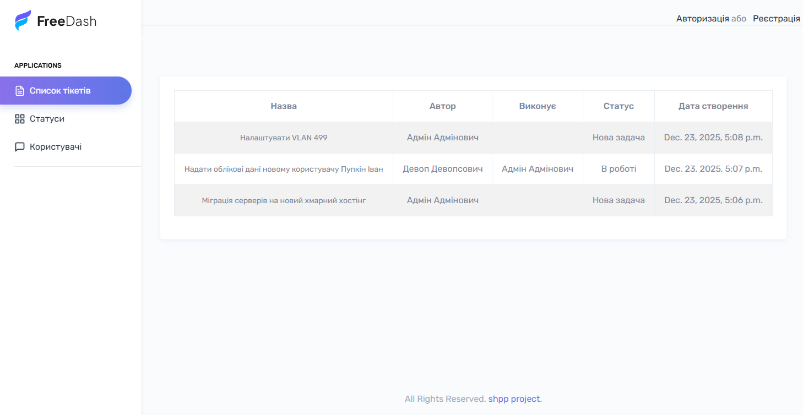
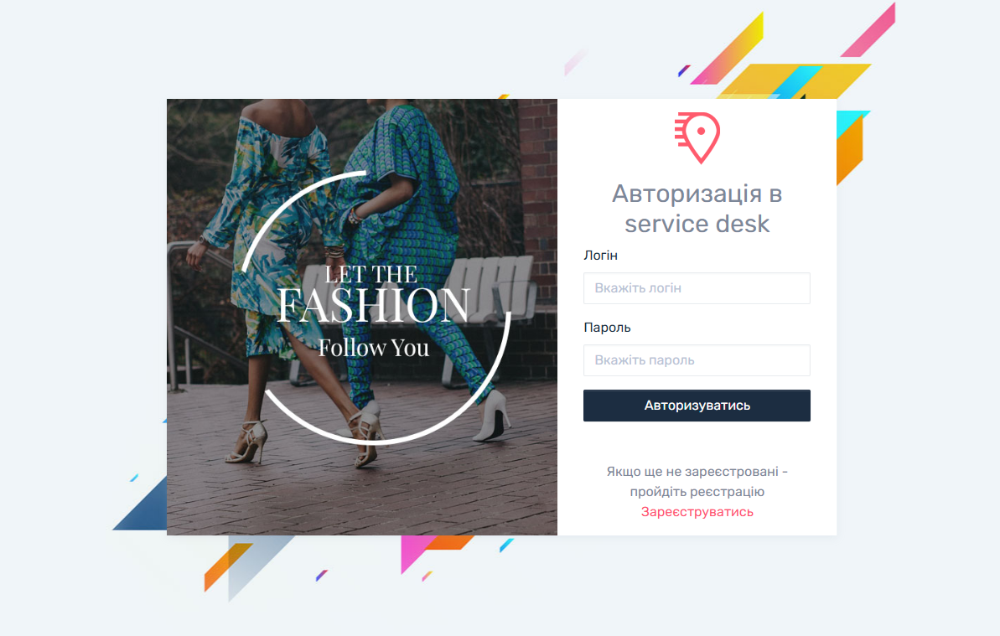
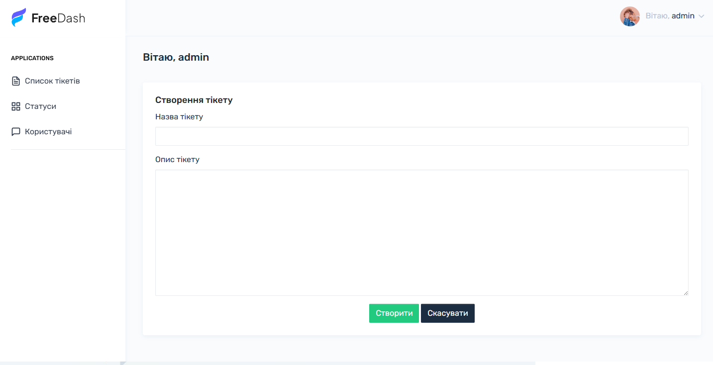
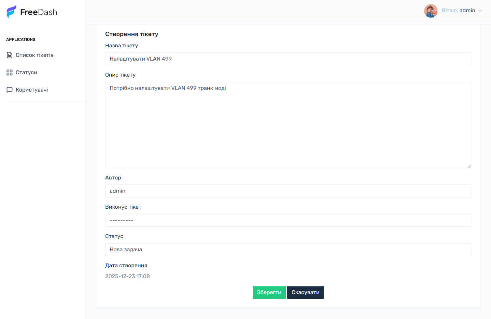
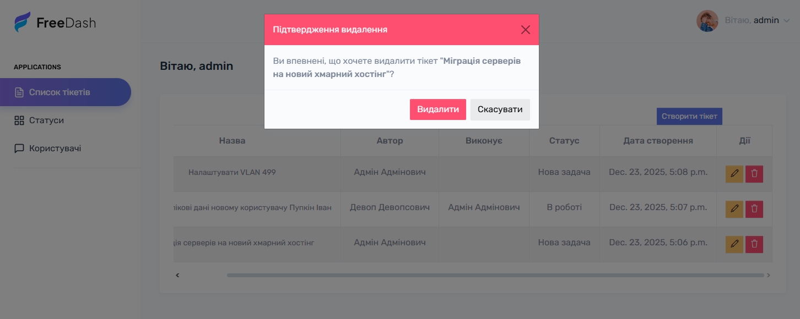

# Service desk project

This project created for learning Django 4+.
As you can see, this project is very simple, but powerful. 
It has 2 application:
* Tickets
* Users

# Tickets
This application using for manage task-related services

# Users
This is custom users models for manage django user

## 🛠 Tech Stack
* Python 3.10 +
* Django 4.2 +

## 📦 Installation
```bash
git clone https://github.com/Molchanov-Ihor/service_desk.git
cd repo
```

### Create venv
`python -m venv venv`

### Activate venv
`venv\script\activate`

### install requiremetns
`pip install -r requirements.txt`

### For starting web:
For starting project use command:

`python manage.py runserver 0.0.0.0:80`

when service up, you can open project in browser with your ip `http://your-ip/`


## Demo :
* **site:** https://service-desk-django.onrender.com

## Credentials 
### Admin:
 * **Login:** admin
 * **Password:** Qwerty123

### DevOps:
 * **Login:** Devops-user
 * **Password:** Qwerty123

## DB STRUCTURE



## images of site pages
### Main page

### Login page

### Registration page

### Registration page

### Create ticket page

### Edit ticket page

### Delete ticket page
